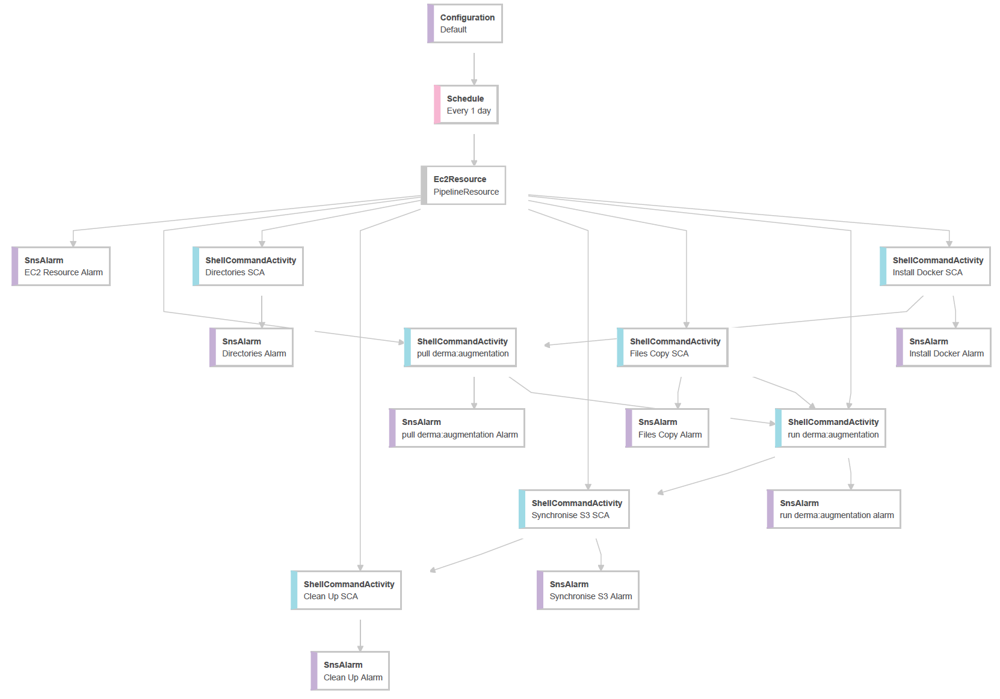

branch|state
:---|:---
develop|
master|
codebuild develop|

<br>

# Augmentation

This repository complements the

* [derma](https://github.com/greyhypotheses/derma)
* [dermatology](https://github.com/greyhypotheses/dermatology)

repositories. It creates augmentations of the original images of [dermatology](https://github.com/greyhypotheses/dermatology) for the models of [derma](https://github.com/greyhypotheses/derma).  Augmentation increases the number of images available for model development.  Much more critically, augmentation is one of the tools for addressing data imbalances; the [dermatoscopic images data set is quite imbalanced.](https://colab.research.google.com/drive/1H1Afh8siQ6bsVdVaaq4qoQASQhNnoyWT).

* Incomplete: doc string texts

<br>
<br>

## Quick Start

This package is used to create/prepare image augmentations for deep convolution neural network modelling.   At present, each augmentation is a square image, albeit three channelled.  [local: python src/main.py [yaml](https://raw.githubusercontent.com/greyhypotheses/dictionaries/develop/augmentation/variables.yml) --sample 64]

```bash
docker pull greyhypotheses/derma:augmentation
mkdir images
docker run -v ~/images:/app/images greyhypotheses/derma:augmentation
    src/main.py {YAML URL} --sample {sample}
```

* YAML URL: The URL of a YAML of parameters/variable, e.g., [variables.yml](https://raw.githubusercontent.com/greyhypotheses/dictionaries/develop/augmentation/variables.yml)
* sample: Optional.  The number of images to initially augment, for previewing purposes.

<br>
<br>

## Steps



The entry point, control centre, of this repository/package is [src/main.py](./src/main.py).  The program runs all the algorithms of this repository/package.  In terms of image transformations, each image is transformed according to the steps of [generator.Generator().augment(...)](./src/data/generator.py)

<br>
<br>

## Running

The augmentation algorithms of this repository are ran via a container of a Docker image.  The image is created by GitHub Actions using this repository's [Dockerfile](./Dockerfile), and automatically pushed to Docker Hub section [greyhypotheses/derma:augmentation](https://hub.docker.com/r/greyhypotheses/derma/tags).

Thus far the image has been pulled & ran within an Amazon EC2 Linux machine:
  * Amazon Linux AMI 2018.03.0.20190826 x86_64 HVM gp2
  * amzn-ami-hvm-2018.03.0.20190826-x86_64-gp2 (ami-00eb20669e0990cb4)

<br>

### Via a Docker Container

In the code snippet below, the required image is *pulled* from Docker Hub after ascertaining that docker is running.  Foremost, to access the EC2 machine

```bash
ssh -i {key pair name}.pem ec2-user@{IPv4 Public IP}
```

This command assumes that the key pair is in the current directory.  Remember, the permissions setting of the key pair must be 400

```bash
chmod 400 {key pair name}.pem
```


#### Is docker running?

```bash
# Update the environment
sudo yum update -y

# Install Docker
sudo yum install -y docker
docker --version
sudo service docker start

# In order to use docker commands without 'sudo'
sudo usermod -a -G docker ec2-user
exit

# Login again
ssh -i {key pair name}.pem ec2-user@{IPv4 Public IP}

# Hence
docker info

```


#### Hence, pull the image

```bash

# Pull image
docker pull greyhypotheses/derma:augmentation

```


#### Run a container

Running a container of the image, as outlined below, runs the algorithms of this repository.  The resulting images are zipped.  If access to a cloud repository is available, a method that automatically transfers the files to the cloud repository can be added to [main.py](./src/main.py).

```bash
# Container
# Help: https://docs.docker.com/engine/reference/commandline/run/
# -v ~/images:/app/images => 
#       mapping local path ~/images to the volume of the container, i.e., /app/images
# -d => 
#       run the container in the background
docker run -d -v ~/images:/app/images greyhypotheses/derma:augmentation {YAML URL} --sample {sample}

# Thus far, how many images?
cd images
ls | wc -l
```

#### Download Option

Case local:

```bash
# https://devhints.io/scp
scp -i {key pair name}.pem ec2-user@{IPv4 Public IP}:~/.../inventory.csv {local directory}
scp -i {key pair name}.pem -r ec2-user@{IPv4 Public IP}:~/.../*.zip {local directory}
```

<br>
<br>

### Docker Help Notes

In the case of *group* actions

```bash
# stop all containers
docker stop $(docker ps -a -q)

# delete all containers, and delete associated volumes
docker rm -v $(docker ps -a -q)

# delete all images
docker rmi $(docker images -a -q)
```
<br>

In the case of single docker containers

```bash
# -v ensures that associated volumes are also deleted
docker rm -v ... [container code]
```

or, just the volumes of the containers

```bash
# List volumes
docker volume ls

# Delete all volumes
docker volume rm $(docker volume ls -q)
```

<br>

Finally, removing a docker image

```bash
# -v ensures that associated volumes are also deleted
docker rmi ... [image code]
```
